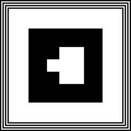
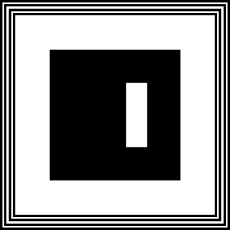

# PolkAR - Markers

This directory contains printable marker images, that are supposed to be glued / printed / laser etched on the sides of the _PolkAR Cube_.

* In the `qr/` folder, there are raw QR codes for the markers. Each QR code contains the text `PolkAR_{number}`, where `{number}` goes from `0000` to `9999` (but only some have been pre-generated so far)
* In the `print/` folder, there are printable, finalized marker images, generated via [this application](https://ar-js-org.github.io/AR.js/three.js/examples/marker-training/examples/generator.html). These can be printed on the sides of the cube to be used in the AR application as trackable markers.
* In the `patt/` folder, there are files corresponding to each marker, that are used by _AR.js_ to detect the markers. These are also generated via [this application](https://jeromeetienne.github.io/AR.js/three.js/examples/marker-training/examples/generator.html).
* In the `docs/` folder, there are PDF / `.docx` files containing markers in a ready-to-print and cut format.

# Barcode-To-Cube-Side

| Barcode Value | Image | Cube Side |
| --- | --- | --- |
| `0` |  | Front |
| `1` |  | Right |
| `2` |  | Back |
| `3` |  | Left |
| `4` |  | Top |
| `5` |  | Bottom |

