# Pitch Deck - Cubo

<div class="pt-12">
  <span @click="$slidev.nav.next" class="px-2 py-1 rounded cursor-pointer" hover="bg-white bg-opacity-10">
    Press Space for next page <carbon:arrow-right class="inline"/>
  </span>
</div>

<div class="abs-br m-6 flex gap-2">
  <button @click="$slidev.nav.openInEditor()" title="Open in Editor" class="text-xl slidev-icon-btn opacity-50 !border-none !hover:text-white">
    <carbon:edit />
  </button>
  <a href="https://github.com/slidevjs/slidev" target="_blank" alt="GitHub" title="Open in GitHub"
    class="text-xl slidev-icon-btn opacity-50 !border-none !hover:text-white">
    <carbon-logo-github />
  </a>
</div>

---
layout: default
---

# Table of contents

<Toc maxDepth="1"></Toc>

---
transition: fade-out
---

# Overview

Cubo is a wooden Cube. It works as a Block Explorer and a beautiful peace of AR Furniture.

- 📣 **Introduction** - A short introduction to the Idea
- ❌ **Problem** - The Problems which are getting tackled
- ✅ **Solution** - The Solution which cubo provides
- 📺 **Demo** - The Video of the MVP 
- 🥴 **Technical Hardships** - The technical diffiuclties that have to be solved
- 🗓️ **Timeline** - An overview of Project Completion
- 🏛️ **Structure** - Unified Project layout
- 📈 **Market** - The commerical Value that Cubo delivers
- 🔎 **Comparision** - Blockexplorer vs Cubo 
- 📒 **Feedback** - Gathered Feedback of Alpha Testers
- 🔚 **Conclusion** - An outro to wrap it up

<br>

Watch our [Presentenation](presenation.cubo.surge.sh) or take a look at our [Documentation](documenation.cubo.surge.sh)


---
transition: slide-up
level: 2
layout: image-right
image: 'https://gcdnb.pbrd.co/images/FbPsQg1ReRCP.jpg?o=1'
---

# 📣 Introduction


```md {1|3,4|6,7|9,10|12,13|15,16|18,19}
- Cubo is a piece of wood.

- Cubo is an AR Object. 
  It displays Holograms.

- Cubo is an Blockexplorer. 
  It displays chain data.

- Cubo is configureable. 
  It adapts to the customer needs.

- Cubo is a Analytics Tool. 
  It creates accesible Dashboards.

- Cubo is loved. 
  Feedback of First Users Test are great.

- Cubo is simple. 
  Its a wooden Cube.
```

> Insert Hologram Picutre and Dashboard Picture


---
layout: image-right
image: https://source.unsplash.com/collection/94734566/1920x1080
---

# ❌ Problem

- 8 Billion People and less 1% had something to do with crypto.

- Everything is non tangible and abstract in crypto.

- Blockexplorer throw a data mess at their Users.


<style>
.footnotes-sep {
  @apply mt-20 opacity-10;
}
.footnotes {
  @apply text-sm opacity-75;
}
.footnote-backref {
  display: none;
}
</style>

---
layout: image-right
image: https://source.unsplash.com/collection/94734566/1920x1080
---

# ✅ Solution 


- Keep it simple. Its a cube. Its grandma friendly.

- Keep it real and appealing. Its a wooden cube.

- Don't throw a mess at users. Ask them beforehand.

- Make it useful. Advanced configureable Dashboards.

---
class: px-20
---

# 📺 Demo 

[Friday Video Draft - Link](https://drive.google.com/file/d/1E49WWr9htOLV6L7cVn1Z-xhDIDZAmnro/view?usp=sharing)  

<iframe width="560" height="315" src="https://www.youtube.com/embed/dQw4w9WgXcQ?si=xkjiqSxCjaIk6Yce" title="YouTube video player" frameborder="0" allow="accelerometer; autoplay; clipboard-write; encrypted-media; gyroscope; picture-in-picture; web-share" allowfullscreen></iframe>


---
preload: false
---

# 🥴 Technical Hardships

- Design & Craft Visulation based on on Chain Data

- Complicated Merge of state of the art Technologies
  - WebAR - Craft an appless auguemnted reality expieriences
  - Semantic Search - find fitting search algorithm
  - AI Assistent - create automtic 3D scene creation 
  - Crypto - polkadot api query crafting

- Keep function and userfriendliness under one hood


---

# 🗓️ Timeline 

###### 10% - MVP (2 weeks)

```plantuml
@startuml
!theme plain
skinparam backgroundColor transparent
skinparam monochrome reverse
concise "MVP Timline" as S
scale  86400 as 80 pixels

@2023/12/08
S is "💡 Ideation"

@2023/12/10
S is "✏️ Sketching"

@2023/12/15
S is "⚙️ To 1st Prototype"

@2023/12/20
S is "🎨 Polish"

@2023/12/22
S is "⏰"

@enduml
```


###### 60% - Alpha (5 months)
```plantuml
@startuml
!theme plain
skinparam backgroundColor transparent
skinparam monochrome reverse
concise "Alpha Timline" as S
scale  2592000 as 250 pixels

@2024/01/08
S is "🔎 Identifiy"

@2024/01/31
S is "✏️ Scratch out"

@2024/03/31
S is "⚙️ Launch ready"

@2024/04/31
S is "📣 Onboard"

@2024/05/31
S is "🚚 Ship it": 05/31

@enduml
```

###### 80% Beta (3 months)
```plantuml
@startuml
!theme plain
skinparam backgroundColor transparent
skinparam monochrome reverse
concise "Beta Timline" as S
scale  2592000 as 300 pixels

@2024/06/01
S is "🔎 Gather FB"

@2024/06/20
S is "✏️ Scratch out"

@2024/07/20
S is "⚙️ relaunch"

@2024/08/15
S is "📣 Onboard"

@2024/09/01
S is "🚚 Ship it": 09/01

@enduml
```

###### 100% - Version 1.0 (3 months)
```plantuml
@startuml
!theme plain
skinparam backgroundColor transparent
skinparam monochrome reverse
concise "Version 1.0 Timline" as S
scale  2592000 as 300 pixels

@2024/09/01
S is "🔎 Gather FB"

@2024/10/01
S is "⚙️ Finalize"

@2024/11/01
S is "📣 Onboard"

@2024/12/01
S is "🚚 Ship it": 12/01

@enduml
```

---

# 🏛️ Structure

- Its a mono repo.
- In packages you can find application, docs, presentation, pitchdeck & buisnessplan, 
- Every package has a README.md 

```bash{all|7}
.
├── README.md
├── components
├── netlify.toml
├── node_modules
├── package-lock.json
├── package.json
├── pages
├── slides.md
└── vercel.json

3 directories, 6 files
```

<br>
<br>
<br>

> Status 22.12.2023 all packages and repos are synced.

---

# 📈 Market (1/3)

## Market Size
  - Total Addresable Furniture Market is 500 billion USD [^1]
  - Total Blockchain Technology Market is 10 billion USD [^2]

## Market Potential
  - Estimated Total Addressable F

[^1]: [Statista, Home+Living+Office](https://www.statista.com/outlook/cmo/furniture/worldwide)
[^2]: [Grandview Research](https://www.grandviewresearch.com/industry-analysis/blockchain-technology-market#:~:text=The%20global%20blockchain%20technology%20market,is%20driving%20the%20market%20growth.)
---

# 📈 Market (2/3)

# Revenue

## Product Revenue
  - Real product sells
  - Data token sells
  - Upgrade sells

> devide in long vs short
---

# 📈 Market (3/3)

## General 

## Product Revenue

--- 
src: ./pages/multiple-entries.md
hide: false
---

---
layout: center
class: text-center
---

# Learn More

[Documentations](https://sli.dev) · [GitHub](https://github.com/slidevjs/slidev) · [Showcases](https://sli.dev/showcases.html)
